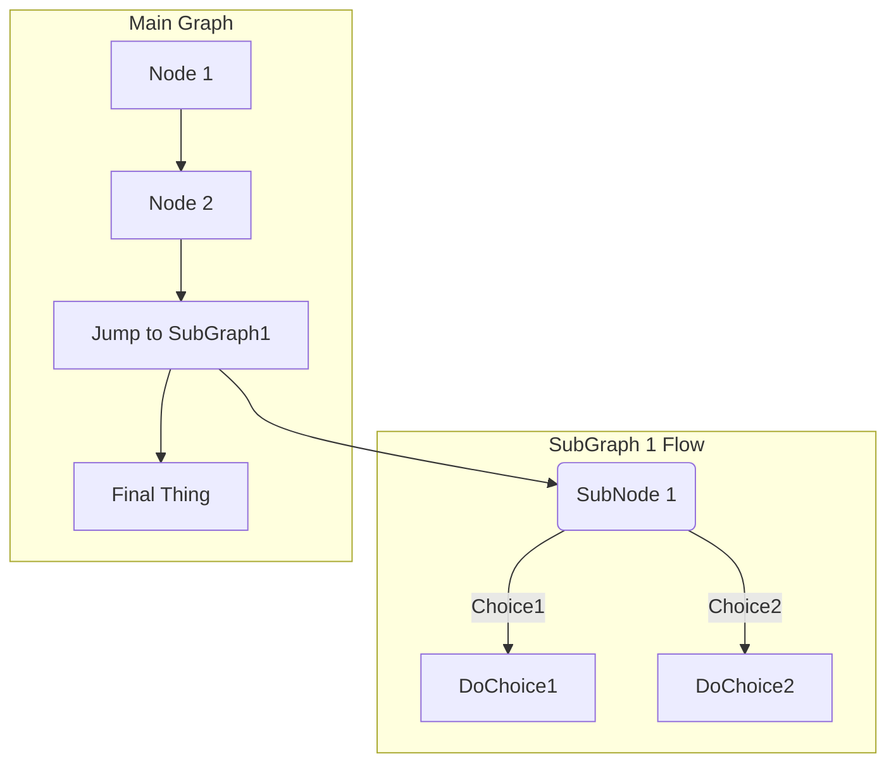

# Eventos dos provedores

Aqui divulgaremos os eventos dos provedores de cloud para você aprimorar sua carreira.

1. AWS
2. Azure
3. GCP
4. OCI

## Azure

https://www.microsoft.com/pt-br/Cloud-Skill-Challenge-Security-Brazil/

